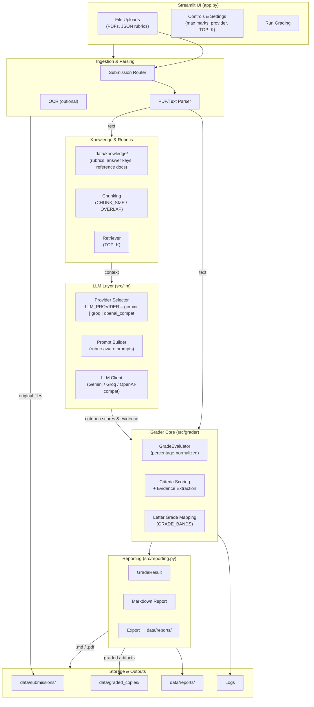
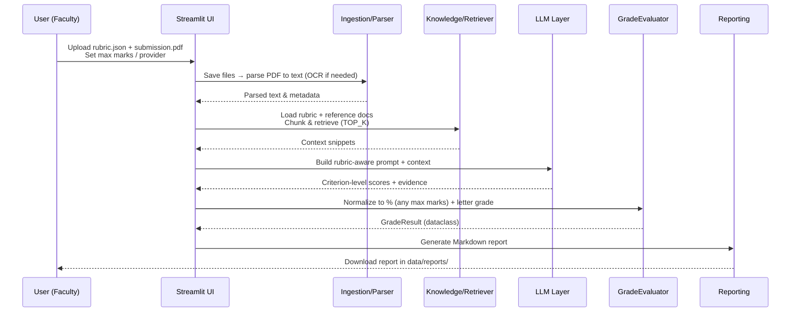

# 📚 GradingAssist – AI-Powered Assignment Grading

[](https://www.python.org/)  
[](https://streamlit.io/)  
[](LICENSE)  

AutoGrader is an **AI-powered grading system** built with **Streamlit + LLMs (Gemini, Groq, OpenAI-compatible APIs)**.  
It enables instructors to **automatically grade assignments, reports, and exams** using **rubrics, percentage-based scoring, and LLM-powered feedback**.  

---

## ✨ Key Features

- 🔍 **Rubric-Based Grading** – Upload detailed rubrics in JSON format for fair, structured grading.  
- 📊 **Percentage Evaluation** – Works for assignments of any maximum marks, normalizing to 100%.  
- 🧠 **AI Feedback Engine** – Uses Gemini / Groq / Prometheus models to justify grades with textual evidence.  
- 📑 **Rich Reports** – Generates markdown (and optionally PDF) reports with scores, grades, and evaluator notes.  
- 📂 **Organized Storage** – Keeps submissions, reports, rubrics, and graded copies in neat data folders.  
- ⚡ **Streamlit UI** – Faculty-friendly drag-and-drop interface.  
- 🛡️ **Customizable** – Easily configure chunk size, overlap, models, and API keys through `.env`.  

---


---

## 🏗️ System Architecture

### Component Overview



### Grading Sequence



## 🏗️ Project Structure

```
AutoGrader/
│── app.py                  # Streamlit app (UI)
│── grader.py               # Core grading pipeline
│── requirements.txt        # Dependencies
│── .env.example            # Example env file
│── .gitignore              # Ignore configs
│── data/
│   ├── submissions/        # Student submissions (PDFs, text)
│   ├── graded_copies/      # Annotated graded submissions
│   ├── reports/            # Generated reports (md/pdf)
│   └── knowledge/          # Rubrics & reference material
│── src/
    ├── grader/             # Grading logic & evaluator
    ├── reporting.py        # Report generator
    └── llm/                # LLM client integrations
```


## 🚀 Getting Started

### 1. Clone the Repository
```bash
git clone https://github.com/dhruvjore/AutoGrader.git
cd AutoGrader
```

### 2. Setup a Virtual Environment
```bash
python -m venv autograder_venv
.\autograder_venv\Scripts\activate   # Windows
# or
source autograder_venv/bin/activate  # Mac/Linux
```

### 3. Install Requirements
```bash
pip install -r requirements.txt
```

### 4. Configure .env
Create a `.env` file in the project root.


### 5. Run the App
```bash
streamlit run app.py
```

---
---

## 📈 Example Workflow

1. Instructor uploads `rubric.json` and `student_submission.pdf`
2. AutoGrader processes rubric & submission
3. AI evaluator assigns percentage + grade (A+, A, B, etc.)
4. Report is saved in `data/reports/` and graded copy in `data/graded_copies/`

---

## 🔮 Roadmap

- [ ] Add support for grading images/diagrams in PDFs
- [ ] Export reports directly to LMS (Canvas, Moodle)
- [ ] Peer-grading and multiple rubrics per assignment
- [ ] Instructor dashboard with analytics & performance trends

---

## 🤝 Contributing

We welcome contributions!

1. Fork this repo
2. Create a new branch: `git checkout -b feature-name`
3. Commit changes: `git commit -m "Added new feature"`
4. Push branch: `git push origin feature-name`
5. Submit a pull request 🚀

---

## 📜 License

This project is licensed under the MIT License – see the LICENSE file for details.

© 2025 Dhruv Jore
